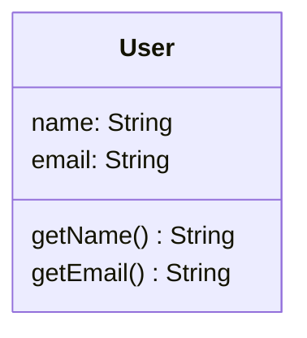

# diagram_dart

A Dart library that analyzes Dart projects and generates diagram from source code, extracting class relationships (extends, implements, with, uses) automatically.

## Features

- **Automatic Analysis**: Walks your Dart project and extracts all class information
- **Relationship Detection**: Detects:
  - `extends` relationships (inheritance)
  - `implements` relationships (interfaces)
  - `with` relationships (mixins)
  - `uses` relationships (detected from field types)
  - `on` constraints for mixins
- **Type Support**: Handles:
  - Regular classes
  - Abstract classes
  - Interface classes
  - Sealed classes
  - Mixins
  - Enums
  - Extension types
- **Mermaid Output**: Generates multiple formats:
  - `.mmd` files (Mermaid diagram syntax)
  - `.json` files (Mermaid Live Editor compatible)
  - `.html` files (Interactive HTML with embedded Mermaid)
  - `.png` files (Rendered diagrams via kroki.io)
- **Interactive Comments**: Dart doc comments (`///`) automatically become clickable tooltips in diagrams
- **Customizable**: Supports `.parseignore` file for excluding directories/files
- **Large Project Support**: Built-in flags to reduce diagram size:
  - `--no-private`: Exclude all private elements (classes and methods starting with `_`)
  - `--no-external`: Exclude stdlib and third-party library classes

## Installation

### As a Library

Add to your `pubspec.yaml`:

```yaml
dependencies:
  diagram_dart: ^0.2.0
```

Then run:

```bash
dart pub get
```

### As a CLI Tool

Install globally:

```bash
dart pub global activate diagram_dart
```

Then use the `diagram_generator` command from anywhere:

```bash
diagram_generator <path> [options]
```

### Updating the CLI Tool

To update to the latest version:

```bash
dart pub global activate diagram_dart
```

This command automatically upgrades to the newest version. To update to a specific version:

```bash
dart pub global activate diagram_dart 0.1.1
```

To check the currently installed version:

```bash
diagram_generator --version
```

## Interactive Comments

Dart documentation comments (`///`) in your code automatically become **interactive click handlers** in generated diagrams!

### How It Works

When you document your classes with Dart doc comments:

```dart
/// Abstract base class for all animals
abstract class Animal {
  void makeSound();
}

/// A concrete dog class with special abilities
class Dog extends Animal {
  @override
  void makeSound() => print('Woof!');
}

/// Repository for managing dogs
class DogRepository {
  Animal getAnimal() => Dog();
}
```

These comments are automatically extracted and added to your diagrams as **interactive click handlers**. When you click on a class in the diagram, an alert shows the documentation comment.

### Supported Formats

The interactive comments appear in all output formats:

- **`.mmd`** - Click handlers in Mermaid syntax: `click Dog "javascript:alert('/// A concrete dog class...')"`
- **`.json`** - Mermaid JSON with click handlers (compatible with Mermaid Live Editor)
- **`.html`** - Interactive HTML diagram with clickable classes showing comments
- **`.png`** - PNG diagram (rendered cleanly without interactive handlers, but generated from documented classes)

### Example Output

Your `.mmd` file will include:

```mermaid
classDiagram
  class Animal {
    <<abstract>>
  }
  class Dog
  class DogRepository

  Animal <|-- Dog : extends
  DogRepository --> Animal : uses

  click Animal "javascript:alert('/// Abstract base class for all animals')"
  click Dog "javascript:alert('/// A concrete dog class with special abilities')"
  click DogRepository "javascript:alert('/// Repository for managing dogs')"
```

### What Gets Included

✅ **Included in diagrams:**
- Documentation comments using `///` (single line or multiple lines)
- Documentation comments using `/** ... */` (block comments)

❌ **Not included:**
- Regular comments using `//` (these are only for code)

### Tips

1. **Document all your classes** - The more detailed your comments, the more useful your diagrams!
2. **Use Mermaid Live Editor** - Copy your JSON output to [mermaid.live](https://mermaid.live) to get an interactive viewer
3. **Open `.html` files in browser** - The HTML version provides the best interactive experience with clickable comments
4. **Share diagrams** - The generated PNG files are perfect for documentation and presentations

## Usage

### Basic Usage

```dart
import 'package:diagram_dart/diagram_dart.dart';

void main() async {
  final parser = ParseDart('path/to/your/project');
  final result = await parser.analyze();

  // Print results
  for (final classInfo in result.classes) {
    print('${classInfo.name} (${classInfo.kind})');
  }

  // Generate Mermaid diagram
  print(result.toMermaid());

  // Save to files
  await result.saveMermaidFile('diagram.mmd');
  await result.saveJsonFile('diagram.json');
}
```

### Command Line Usage

#### Using the CLI Tool

```bash
# Analyze current directory (generate all formats)
diagram_generator.

# Analyze a specific project
diagram_generator~/my_dart_project

# Analyze a monorepo with multiple packages
diagram_generator. --monorepo

# Generate only Mermaid diagram
diagram_generator. --format mermaid

# Generate specific format with custom output name
diagram_generator. --format html --prefix my_architecture

# Verbose output
diagram_generator. --verbose

# Exclude private methods (reduce diagram size)
diagram_generator. --no-private

# Exclude external libraries (great for large projects)
diagram_generator. --no-external

# Combine filters for minimal diagram
diagram_generator. --no-private --no-external --format html

# Show help
diagram_generator--help
```

**Options:**
- `--input <path>` - Path to the Dart project to analyze (default: `.`)
- `--format <format>` - Output format: `mermaid`, `json`, `html`, `png`, or `all` (default)
- `--prefix <name>` - Custom project name for output files (default: auto-detect from pubspec.yaml)
- `--output-dir <path>` - Output directory path (default: `mermaid_output_parse`)
- `--monorepo` - Analyze as a monorepo (finds and analyzes all packages in nested directories)
- `--no-private` - Exclude private methods (starting with `_`) from diagram
- `--no-external` - Exclude external classes (stdlib and third-party libraries) from diagram
- `--verbose` - Show detailed analysis output
- `-h, --help` - Show help message
- `-v, --version` - Show version

**Output Location and Naming:**

By default, all output files are saved to `mermaid_output_parse/` folder with this naming pattern:

```
mermaid_output_parse/
├── <project-name>_parse_diagram.mmd      # Mermaid syntax
├── <project-name>_parse_diagram.json     # Mermaid JSON (Live Editor compatible)
├── <project-name>_parse_diagram.html     # Interactive HTML diagram
└── <project-name>_parse_diagram.png      # Rendered PNG
```

The project name is automatically detected from `pubspec.yaml`. You can customize it with `--prefix` and `--output-dir`:

```bash
# Auto-detect from pubspec.yaml
diagram_generator. --format all

# Custom name and directory
diagram_generator. --prefix my_architecture --output-dir ./diagrams --format html

# Different output directory
diagram_generator. --output-dir ./build/diagrams
```

**Monorepo Support:**

The tool automatically scans for all packages (directories containing `pubspec.yaml`) and analyzes them together:

```bash
# For a monorepo with this structure:
# monorepo/
# ├── packages/
# │   ├── package_a/pubspec.yaml
# │   └── package_b/pubspec.yaml
# └── services/
#     └── shared_lib/pubspec.yaml

diagram_generator. --monorepo
```

This will generate a single diagram showing all classes from all packages and their relationships. Works with any nesting depth!

#### Using the Example Script

```bash
dart run example/main.dart
```

This analyzes the test fixtures and generates diagram files.

## Output Examples

### Class Information

```dart
ClassInfo(
  name: 'Dog',
  filePath: 'test/fixtures/dog.dart',
  kind: ClassKind.classKind,
  extendsClass: 'Animal',
  implementsList: ['Runnable'],
  withList: ['Swimmer', 'PetOwner'],
  usesList: [],
  documentation: '/// A concrete dog class that demonstrates multiple relationships',
)
```

### Mermaid Diagram (with Interactive Comments)

```mermaid
classDiagram
  class Animal {
    <<abstract>>
  }
  class Dog
  class Runnable {
    <<interface>>
  }
  class Swimmer {
    <<mixin>>
  }

  Animal <|-- Dog : extends
  Runnable <|.. Dog : implements
  Swimmer <|.. Dog : with

  click Animal "javascript:alert('/// Abstract base class for animals')"
  click Dog "javascript:alert('/// A concrete dog class that demonstrates multiple relationships')"
  click Runnable "javascript:alert('/// Abstract interface for things that can run')"
  click Swimmer "javascript:alert('/// Mixin for animals that can swim')"
```

**Click on a class name in the diagram above to see its documentation comment!**

## .parseignore

Create a `.parseignore` file in your project root to exclude directories/files:

```
# Example .parseignore
.dart_tool/
build/
.git/
test/vendor/**
```

Default exclusions:
- `.dart_tool/`
- `build/`
- `.git/`
- `.packages`
- `.gitignore`

## Project Structure

```
parse_mermaid_dart/
├── lib/
│   ├── parse_mermaid_dart.dart      # Public API entry point
│   └── src/
│       ├── models/
│       │   ├── class_info.dart      # ClassInfo and ClassKind
│       │   └── relationship.dart    # RelationshipKind enum
│       ├── parser/
│       │   ├── dart_parser.dart     # AST parser
│       │   └── file_walker.dart     # Filesystem walker
│       └── generator/
│           └── mermaid_generator.dart  # Mermaid diagram generation
├── test/
│   ├── parse_dart_test.dart         # Unit tests
│   └── fixtures/                    # Test case fixtures
├── example/
│   └── main.dart                    # Example usage
└── pubspec.yaml
```

## Handling Large Projects

For large projects with many dependencies or private implementation details, use filtering flags to reduce diagram complexity:

### Problem: "Maximum Text Size" Error

Large diagrams (26KB+) may exceed Mermaid's default rendering limit. This tool automatically handles up to 500KB diagrams in HTML format.

### Solution: Use Filtering Flags

**Option 1: Exclude All Private Elements**

```bash
diagram_generator. --no-private
```

Removes all private classes and methods (anything starting with `_`) to focus on public API:



**Option 2: Exclude External Libraries**

```bash
diagram_generator. --no-external
```

Removes stdlib and third-party library classes (like `List`, `Map`, `Equatable`, etc.) to show only your project's classes:

Before: Includes 25+ external classes
After: Only your internal classes (typically 3-5x smaller)

**Option 3: Combine Both Filters (Recommended)**

```bash
diagram_generator. --no-private --no-external --format html
```

For ErmesDart and similar large projects, this typically reduces diagram size by 50-80%.

### Size Comparison Example

```bash
# All details
diagram_generator. --format html
# Output: ~350KB diagram

# No private methods
diagram_generator. --no-private --format html
# Output: ~300KB diagram

# No external classes
diagram_generator. --no-external --format html
# Output: ~150KB diagram

# Minimal diagram (recommended for large projects)
diagram_generator. --no-private --no-external --format html
# Output: ~50-100KB diagram
```

### When to Use Each Option

- **`--no-private`**: When you want to document public API architecture (removes all classes/methods starting with `_`)
- **`--no-external`**: When external dependencies clutter the diagram
- **Both**: For large projects, best visualization, or documentation purposes

## Testing

Run tests:

```bash
dart test
```

All tests are green ✓

## API Reference

### `ParseDart`

Main entry point for analyzing projects.

```dart
class ParseDart {
  /// Initialize with project path
  ParseDart(String projectPath);

  /// Analyze the project and return results
  Future<ParseResult> analyze();
}
```

### `ParseResult`

Result of analysis containing all classes found.

```dart
class ParseResult {
  /// All classes found in the project
  final List<ClassInfo> classes;

  /// Generate Mermaid diagram as string
  ///
  /// Options:
  /// - noPrivate: Exclude private methods (starting with _)
  /// - noExternal: Exclude external library classes
  String toMermaid({bool noPrivate = false, bool noExternal = false});

  /// Generate Mermaid JSON (Live Editor compatible)
  Map<String, dynamic> toMermaidJson({bool noPrivate = false, bool noExternal = false});

  /// Generate HTML with embedded diagram
  String toHtml({bool noPrivate = false, bool noExternal = false});

  /// Save diagram to .mmd file
  Future<void> saveMermaidFile(String outputPath,
    {bool noPrivate = false, bool noExternal = false});

  /// Save JSON to file
  Future<void> saveJsonFile(String outputPath,
    {bool noPrivate = false, bool noExternal = false});

  /// Save interactive HTML file
  Future<void> saveHtmlFile(String outputPath,
    {bool noPrivate = false, bool noExternal = false});

  /// Save diagram as PNG (requires kroki.io)
  Future<void> savePngFile(String outputPath,
    {bool noPrivate = false, bool noExternal = false});
}
```

### `ClassInfo`

Information about a single class.

```dart
class ClassInfo {
  final String name;
  final String filePath;              // Relative to project root
  final ClassKind kind;
  final String? extendsClass;
  final List<String> implementsList;
  final List<String> withList;        // Mixins or 'on' constraints
  final List<String> usesList;        // Classes used in fields
  final String? documentation;        // Dart doc comments (///)
}
```

### `ClassKind`

Enum representing types of classes:

- `classKind` - Regular class
- `abstractClass` - Abstract class
- `mixin` - Mixin declaration
- `interfaceClass` - Abstract interface class
- `sealedClass` - Sealed class
- `enumKind` - Enum
- `extensionType` - Extension type

## Limitations

- Only detects relationships through field type annotations (not method parameters or return types)
- Only detects uses relationships for classes defined within the project
- Does not support generic type analysis in depth

## Dependencies

- `analyzer` ^6.0.0 - Dart AST parsing
- `glob` ^2.1.2 - File pattern matching
- `path` ^1.9.0 - Path utilities

## License

MIT

## Contributing

Contributions are welcome! Please ensure all tests pass and add tests for new features.

```bash
dart test
```

## Example Output

When run on the test fixtures, generates:

```
Found 13 classes:
  - Animal (ClassKind.abstractClass)
  - Dog (ClassKind.classKind)
      extends: Animal
      implements: Runnable
      with: Swimmer, PetOwner
  - Circle (ClassKind.classKind)
      extends: Shape
  - Status (ClassKind.enumKind)
      implements: Comparable
```

Copy the JSON output to [mermaid.live](https://mermaid.live) to visualize the diagram!

## Release Notes

### v0.1.1 - Large Project Support

**New Features:**
- ✨ **Increased maxTextSize**: HTML diagrams now support up to 500KB (10x the default limit)
- 🎯 **`--no-private` flag**: Exclude private methods to simplify diagrams
- 🔍 **`--no-external` flag**: Exclude stdlib and third-party library classes
- 📊 **Better handling of large projects**: ErmesDart and similar projects now render without errors

**What's Fixed:**
- Fixed "maximum text size" error for diagrams larger than 50KB
- Improved performance for projects with many external dependencies
- Better documentation in help message

**Examples:**
```bash
# Minimal diagram for large projects
diagram_generator. --no-private --no-external

# Focus on public API
diagram_generator. --no-private

# Internal architecture without external noise
diagram_generator. --no-external
```

### v0.1.0 - Initial Release

- Automatic Dart project analysis
- Mermaid class diagram generation
- Support for multiple output formats (mmd, json, html, png)
- Interactive documentation comments
- Monorepo support
- Customizable with .parseignore
