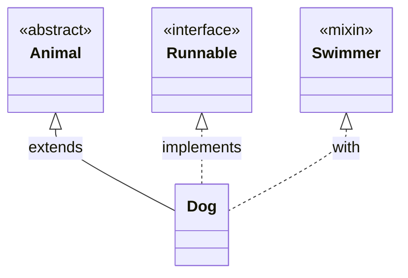

# parse_dart

A Dart library that analyzes Dart projects and generates Mermaid class diagrams, extracting class relationships (extends, implements, with, uses) automatically.

## Features

- **Automatic Analysis**: Walks your Dart project and extracts all class information
- **Relationship Detection**: Detects:
  - `extends` relationships (inheritance)
  - `implements` relationships (interfaces)
  - `with` relationships (mixins)
  - `uses` relationships (detected from field types)
  - `on` constraints for mixins
- **Type Support**: Handles:
  - Regular classes
  - Abstract classes
  - Interface classes
  - Sealed classes
  - Mixins
  - Enums
  - Extension types
- **Mermaid Output**: Generates both:
  - `.mmd` files (Mermaid diagram syntax)
  - `.json` files (Mermaid Live Editor compatible)
- **Customizable**: Supports `.parseignore` file for excluding directories/files

## Installation

Add to your `pubspec.yaml`:

```yaml
dependencies:
  parse_dart: ^0.1.0
```

Then run:

```bash
dart pub get
```

## Usage

### Basic Usage

```dart
import 'package:parse_dart/parse_dart.dart';

void main() async {
  final parser = ParseDart('path/to/your/project');
  final result = await parser.analyze();

  // Print results
  for (final classInfo in result.classes) {
    print('${classInfo.name} (${classInfo.kind})');
  }

  // Generate Mermaid diagram
  print(result.toMermaid());

  // Save to files
  await result.saveMermaidFile('diagram.mmd');
  await result.saveJsonFile('diagram.json');
}
```

### Command Line Usage

```bash
dart run example/main.dart
```

This analyzes the test fixtures and generates diagram files.

## Output Examples

### Class Information

```dart
ClassInfo(
  name: 'Dog',
  filePath: 'test/fixtures/dog.dart',
  kind: ClassKind.classKind,
  extendsClass: 'Animal',
  implementsList: ['Runnable'],
  withList: ['Swimmer', 'PetOwner'],
  usesList: [],
)
```

### Mermaid Diagram



## .parseignore

Create a `.parseignore` file in your project root to exclude directories/files:

```
# Example .parseignore
.dart_tool/
build/
.git/
test/vendor/**
```

Default exclusions:
- `.dart_tool/`
- `build/`
- `.git/`
- `.packages`
- `.gitignore`

## Project Structure

```
parse_dart/
├── lib/
│   ├── parse_dart.dart              # Public API entry point
│   └── src/
│       ├── models/
│       │   ├── class_info.dart      # ClassInfo and ClassKind
│       │   └── relationship.dart    # RelationshipKind enum
│       ├── parser/
│       │   ├── dart_parser.dart     # AST parser
│       │   └── file_walker.dart     # Filesystem walker
│       └── generator/
│           └── mermaid_generator.dart  # Mermaid diagram generation
├── test/
│   ├── parse_dart_test.dart         # Unit tests
│   └── fixtures/                    # Test case fixtures
├── example/
│   └── main.dart                    # Example usage
└── pubspec.yaml
```

## Testing

Run tests:

```bash
dart test
```

All tests are green ✓

## API Reference

### `ParseDart`

Main entry point for analyzing projects.

```dart
class ParseDart {
  /// Initialize with project path
  ParseDart(String projectPath);

  /// Analyze the project and return results
  Future<ParseResult> analyze();
}
```

### `ParseResult`

Result of analysis containing all classes found.

```dart
class ParseResult {
  /// All classes found in the project
  final List<ClassInfo> classes;

  /// Generate Mermaid diagram as string
  String toMermaid();

  /// Generate Mermaid JSON (Live Editor compatible)
  Map<String, dynamic> toMermaidJson();

  /// Save diagram to .mmd file
  Future<void> saveMermaidFile(String outputPath);

  /// Save JSON to file
  Future<void> saveJsonFile(String outputPath);
}
```

### `ClassInfo`

Information about a single class.

```dart
class ClassInfo {
  final String name;
  final String filePath;              // Relative to project root
  final ClassKind kind;
  final String? extendsClass;
  final List<String> implementsList;
  final List<String> withList;        // Mixins or 'on' constraints
  final List<String> usesList;        // Classes used in fields
}
```

### `ClassKind`

Enum representing types of classes:

- `classKind` - Regular class
- `abstractClass` - Abstract class
- `mixin` - Mixin declaration
- `interfaceClass` - Abstract interface class
- `sealedClass` - Sealed class
- `enumKind` - Enum
- `extensionType` - Extension type

## Limitations

- Only detects relationships through field type annotations (not method parameters or return types)
- Only detects uses relationships for classes defined within the project
- Does not support generic type analysis in depth

## Dependencies

- `analyzer` ^6.0.0 - Dart AST parsing
- `glob` ^2.1.2 - File pattern matching
- `path` ^1.9.0 - Path utilities

## License

MIT

## Contributing

Contributions are welcome! Please ensure all tests pass and add tests for new features.

```bash
dart test
```

## Example Output

When run on the test fixtures, generates:

```
Found 13 classes:
  - Animal (ClassKind.abstractClass)
  - Dog (ClassKind.classKind)
      extends: Animal
      implements: Runnable
      with: Swimmer, PetOwner
  - Circle (ClassKind.classKind)
      extends: Shape
  - Status (ClassKind.enumKind)
      implements: Comparable
```

Copy the JSON output to [mermaid.live](https://mermaid.live) to visualize the diagram!
